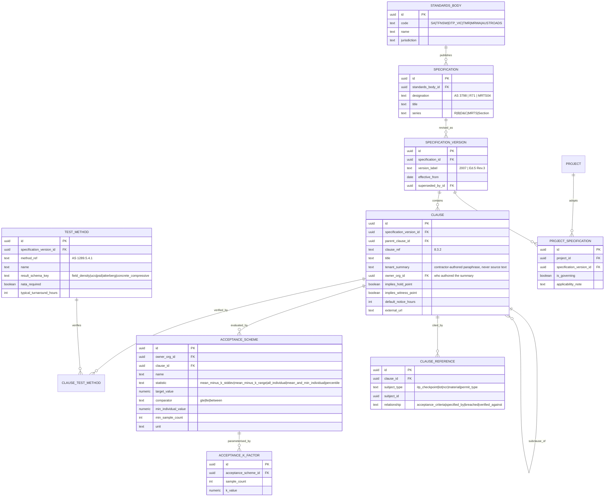
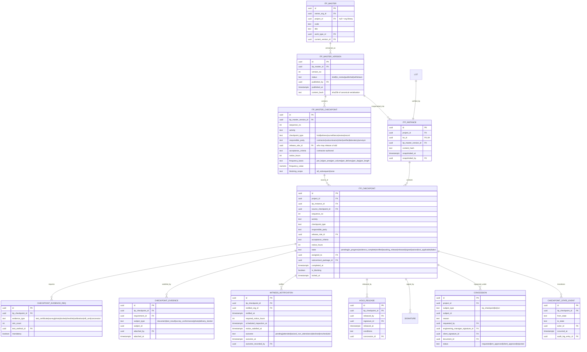
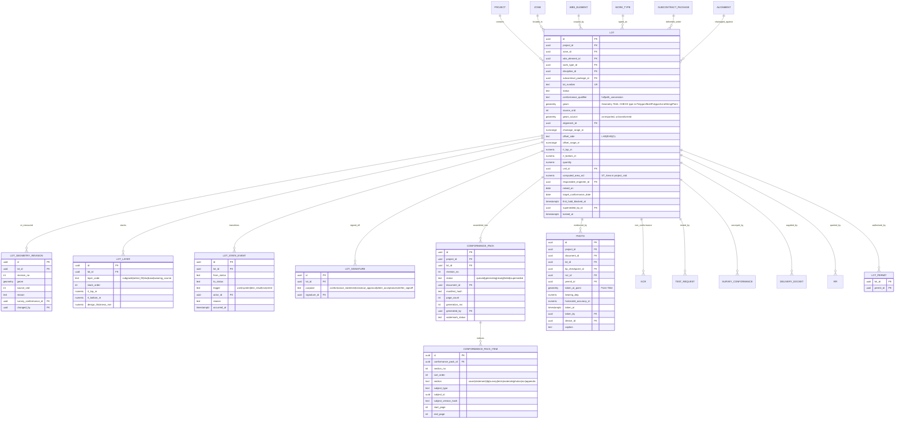

# 01 — Data model / ERD

**Status: proposed, awaiting review. No code written yet.**

Conventions used throughout:

- All PKs are `uuid` (v7, time-ordered — index locality matters at 10k+ lots).
- Every business table carries `project_id` denormalised, even where derivable.
  This is deliberate: RLS predicates must be a single indexed lookup, not a join
  chain (see `04-rls-and-enforcement.md`). Integrity is held by a composite FK
  back to the parent so `project_id` cannot drift.
- Every table has `created_at`, `created_by`, `updated_at`, `updated_by`.
- **No table has a `deleted_at`.** Removal is `superseded_by_id` +
  `superseded_at` + `supersede_reason_id`. `DELETE` is revoked from the
  application role at the database level.
- Signed records additionally carry `locked_at`; a `BEFORE UPDATE` trigger
  rejects any change to a locked row other than setting supersession fields.
- Geometry columns are `geometry(<type>, 7844)` — GDA2020 geographic. See ADR-0004.
- Money is `numeric(14,2)` + `currency char(3)`. Never float.
- Quantities are `numeric(14,3)` + `unit_id`. Never float.

The nine sub-models below compose into one schema; entities appear in the
diagram of the domain that owns them and are referenced by name elsewhere.

---

## A. Tenancy, identity and access

Multi-tenancy here is **not** a single `tenant_id` column. A project delivered by
a joint venture has two contractor tenants; the client, the independent verifier,
each subcontractor and each supplier are separate organisations whose users need
scoped access to the same project. The tenancy edge is therefore
`project_participant`, and the access edge is `project_membership`.

```mermaid
erDiagram
    ORGANISATION ||--o{ ORG_MEMBERSHIP : employs
    USER_ACCOUNT ||--o{ ORG_MEMBERSHIP : belongs_to
    ORGANISATION ||--o{ PROJECT_PARTICIPANT : participates_as
    PROJECT ||--o{ PROJECT_PARTICIPANT : has
    PROJECT ||--o{ PROJECT_MEMBERSHIP : grants
    USER_ACCOUNT ||--o{ PROJECT_MEMBERSHIP : holds
    ROLE ||--o{ PROJECT_MEMBERSHIP : typed_by
    ROLE ||--o{ ROLE_PERMISSION : bundles
    PERMISSION ||--o{ ROLE_PERMISSION : granted_in
    PROJECT_MEMBERSHIP ||--o{ ACCESS_GRANT : materialises
    USER_ACCOUNT ||--o{ PERMISSION_GRANT : exception_grant
    USER_ACCOUNT ||--o{ DELEGATION : delegates
    USER_ACCOUNT ||--o{ AUTH_IDENTITY : authenticates_via
    USER_ACCOUNT ||--o{ DEVICE : registers
    ORGANISATION ||--o{ SUBCONTRACT_PACKAGE : awarded
    PROJECT ||--o{ SUBCONTRACT_PACKAGE : contains

    ORGANISATION {
        uuid id PK
        text legal_name
        text abn
        text org_type "contractor|client|subcontractor|supplier|verifier|consultant|laboratory"
        jsonb branding
        boolean is_tenant
    }
    USER_ACCOUNT {
        uuid id PK
        citext email UK
        text full_name
        text mobile_e164
        text status "invited|active|suspended|departed"
        uuid primary_org_id FK
    }
    AUTH_IDENTITY {
        uuid id PK
        uuid user_id FK
        text provider "entra|credentials"
        text subject UK
        timestamptz mfa_enrolled_at
    }
    PROJECT_PARTICIPANT {
        uuid id PK
        uuid project_id FK
        uuid organisation_id FK
        text participation "lead_contractor|jv_partner|client|superintendent|verifier|subcontractor|supplier|consultant"
        numeric jv_share_pct
        jsonb branding_override
        daterange active_period
    }
    PROJECT_MEMBERSHIP {
        uuid id PK
        uuid project_id FK
        uuid user_id FK
        uuid role_id FK
        text scope_type "project|zone|package|crew|supplier_org"
        uuid scope_id
        daterange active_period
        uuid granted_by FK
    }
    ACCESS_GRANT {
        uuid user_id PK
        uuid project_id PK
        text scope_type PK
        uuid scope_id PK
        text side "contractor|client|verifier|external"
    }
    ROLE {
        uuid id PK
        uuid owner_org_id FK "null = system template"
        text code
        text name
        text side "contractor|client|verifier|external"
        boolean is_system_template
    }
    PERMISSION {
        text code PK "e.g. lot.closeout.approve"
        text resource
        text action
        text description
        boolean requires_signature
    }
    ROLE_PERMISSION {
        uuid role_id PK
        text permission_code PK
        jsonb constraint_json "e.g. {max_cost_impact: 50000}"
    }
    PERMISSION_GRANT {
        uuid id PK
        uuid user_id FK
        uuid project_id FK
        text permission_code FK
        tstzrange valid_period
        uuid granted_by FK
        text justification
    }
    DELEGATION {
        uuid id PK
        uuid project_id FK
        uuid from_user_id FK
        uuid to_user_id FK
        text[] permission_codes
        tstzrange valid_period
        boolean signature_delegable "always false for hold release"
    }
    DEVICE {
        uuid id PK
        uuid user_id FK
        text device_fingerprint
        text platform
        timestamptz last_seen_at
    }
    SUBCONTRACT_PACKAGE {
        uuid id PK
        uuid project_id FK
        uuid subcontractor_org_id FK
        text package_code
        text scope_description
    }
```

| Entity | Purpose | Notes |
|---|---|---|
| `organisation` | Any legal entity in the delivery chain. | `is_tenant` marks orgs that can own projects and roles. A subcontractor is an organisation, not a text field on a lot. |
| `user_account` | Global identity. One human, one row, even if they work for two orgs over time. | Email is the natural key; `citext` so case never forks an identity. |
| `auth_identity` | Auth method binding. | Separate row per provider so a user can hold Entra SSO and (for field devices without Entra) credentials. |
| `project_participant` | Which organisations are on this project and in what capacity. | This is what makes a JV expressible: two rows with `participation = lead_contractor` / `jv_partner`, each with its own branding. |
| `project_membership` | Which user has which role, at what scope, for what period. | Scope narrows a role: a Section Engineer's `scope_type = 'zone'`. Expiry is a date range, so a departed sub's access lapses without a delete. |
| `access_grant` | Flattened, trigger-maintained projection of `project_membership`. | Exists purely so RLS predicates are one index probe. Never written by application code. `side` drives the client/contractor UI shell split. |
| `role` | A named bundle of permissions, tenant-customisable. | Ships as system templates matching the org chart in §2; tenants clone and adjust. Not three hardcoded tiers. |
| `permission` | The action catalogue. | Verb-level, e.g. `checkpoint.hold.release`, `ncr.disposition.use_as_is.approve`. |
| `role_permission.constraint_json` | Numeric/contextual bounds on a permission. | How "approve NCR closeout > $50k" is expressed without a special-case role. |
| `permission_grant` | Time-boxed individual exception. | Every one is audited and justified; used for cover during leave, secondments. |
| `delegation` | Acting-for. | `signature_delegable` is hard-false for hold point release and conformance signature — a delegate cannot sign a hold point. |
| `device` | Binds a signature to hardware. | Referenced by `signature`; required for the immutable signature record. |
| `subcontract_package` | The unit a subcontractor is scoped to. | Lots, dockets and NCRs carry `subcontract_package_id`; this is the row-level fence between subs. |

---

## B. Project structure and the spatial framework

The spatial framework is defined before the QA objects, because a lot's identity
includes where it is.

```mermaid
erDiagram
    PROJECT ||--|| CONTRACT : governed_by
    PROJECT ||--o{ ZONE : divided_into
    ZONE ||--o{ ZONE : nests
    PROJECT ||--o{ DISCIPLINE : uses
    PROJECT ||--o{ WBS_ELEMENT : decomposes_to
    WBS_ELEMENT ||--o{ WBS_ELEMENT : parent_of
    PROJECT ||--o{ ALIGNMENT : has
    ALIGNMENT ||--o{ ALIGNMENT_EQUATION : discontinuous_at
    PROJECT ||--o{ WORK_TYPE : library
    PROJECT ||--|| LOT_NUMBER_SCHEME : numbered_by
    PROJECT ||--o{ MAP_LAYER : overlays
    MAP_LAYER ||--o{ MAP_LAYER_CAPTURE : dated_captures
    PROJECT ||--o{ COORDINATE_SYSTEM : declares

    PROJECT {
        uuid id PK
        text name
        text code UK
        uuid client_org_id FK
        text status "tender|delivery|defects_liability|closed"
        int mga_zone "49..56"
        int project_srid "7849..7856"
        text vertical_datum "AHD71"
        daterange delivery_period
        date defects_liability_end
    }
    CONTRACT {
        uuid id PK
        uuid project_id FK
        text contract_number
        uuid superintendent_user_id FK
        uuid verifier_org_id FK
        text spec_suite "TfNSW|DTP_VIC|TMR_QLD|MRWA|custom"
        int retention_years
    }
    ZONE {
        uuid id PK
        uuid project_id FK
        uuid parent_zone_id FK
        text code
        text name
        geometry boundary "Polygon 7844"
        uuid alignment_id FK
        numrange chainage_range
    }
    DISCIPLINE {
        uuid id PK
        uuid project_id FK
        text code "CIV|STR|DRN|UTL|LSC|ITS|PAV"
        text name
    }
    WBS_ELEMENT {
        uuid id PK
        uuid project_id FK
        uuid parent_id FK
        uuid discipline_id FK
        text wbs_code
        text description
        numeric budget_quantity
        uuid unit_id FK
        ltree path
    }
    ALIGNMENT {
        uuid id PK
        uuid project_id FK
        text name "e.g. Mulgoa Rd MC01"
        geometry centreline "LineStringZM 7844"
        numeric start_chainage_m
        int source_srid
        text source_ref "LandXML file"
        int revision
    }
    ALIGNMENT_EQUATION {
        uuid id PK
        uuid alignment_id FK
        numeric back_chainage_m
        numeric ahead_chainage_m
        text reason
    }
    WORK_TYPE {
        uuid id PK
        uuid project_id FK
        uuid discipline_id FK
        text code "EW|SF|SBC|BASE|AC|CONC|PIPE"
        text name
        uuid default_itp_master_id FK
        uuid default_unit_id FK
        text geometry_kind "polygon|line|point"
        boolean is_layered
    }
    LOT_NUMBER_SCHEME {
        uuid id PK
        uuid project_id FK
        text template "{zone}-{worktype}-{seq:4}"
        text sequence_scope "project|zone|zone_worktype"
    }
    COORDINATE_SYSTEM {
        uuid id PK
        uuid project_id FK
        int srid
        text label "MGA2020 Zone 56"
        boolean is_default_import
    }
    MAP_LAYER {
        uuid id PK
        uuid project_id FK
        text layer_kind "aerial|orthomosaic|design|cadastre|services|environmental|traffic_stage|bim"
        text name
        text provider "nearmap|metromap|esri|upload"
        numeric default_opacity
        int z_index
    }
    MAP_LAYER_CAPTURE {
        uuid id PK
        uuid map_layer_id FK
        date captured_on
        text tile_url_template
        uuid document_id FK "COG/GeoTIFF if uploaded"
        geometry footprint "Polygon 7844"
    }
```

| Entity | Purpose | Notes |
|---|---|---|
| `project.mga_zone` / `project_srid` | The project's working projected CRS. | Held explicitly. Areas, lengths and quantities are computed in this SRID, not on geography — so they match the surveyor's numbers. |
| `contract` | The commercial frame: client, superintendent, spec suite, retention. | Drives which specification suite the standards library defaults to, and the retention/archive horizon. |
| `zone` | Geographic/organisational subdivision, nestable. | Carries both a boundary polygon *and* an optional chainage range; road projects think in chainage, structures projects think in polygons, and both are valid. |
| `wbs_element` | Scope decomposition tree. | `ltree path` so "everything under WBS 3.2" is one indexed query, not recursion. |
| `alignment` | The design centreline. | `LineStringZM` — the M ordinate carries chainage directly, so `ST_LineLocatePoint`/`ST_LineInterpolatePoint` give chainage↔coordinate conversion natively and correctly. |
| `alignment_equation` | Chainage discontinuities. | Without this, chainage→coordinate is silently wrong downstream of any re-design. Modelled because real projects have them. |
| `work_type` | Project activity library. | Carries the default master ITP (so the raise wizard auto-attaches), the default unit, the expected geometry kind, and whether it participates in the pavement layer-cake. |
| `lot_number_scheme` | Per-project lot numbering convention. | Template-driven; `Z3-EW-0142` is a rendering, not a hardcoded format. |
| `map_layer` / `map_layer_capture` | Every overlay, with dated captures. | One layer, many captures = the aerial time slider and the monthly drone orthomosaic history, using the same mechanism. |

---

## C. Standards and specification library

**Copyright constraint is structural, not a policy note.** There is no column
anywhere in this domain for the text of a standard or a client specification.
The schema stores identifiers, titles, and *the contractor's own* paraphrased
acceptance criteria. See ADR-0006.

| Entity | Purpose | Notes |
|---|---|---|
| `specification_version` | Specs get revised mid-project. | A lot must record which *version* governed it. Superseding a version never rewrites history on closed lots. |
| `clause.tenant_summary` | The contractor's own words. | Ships empty. The UI states plainly at the point of entry that source text must not be pasted. |
| `acceptance_scheme` + `acceptance_k_factor` | Lot acceptance statistics, as data. | The statistical *method* is public engineering practice and is shipped; the k-factor tables are specification content and are **tenant-populated**. This is what makes §12.5 computable without reproducing spec text. See ADR-0007. |
| `clause_reference` | Polymorphic citation edge. | This single table is what answers *"show me every lot verified against AS 3798 cl. 8.3 and every test result proving it"* — the query no competitor can run. |

---

## D. ITP master, instance and checkpoints

| Entity | Purpose | Notes |
|---|---|---|
| `itp_master_version.content_hash` | Canonical hash of the published version. | Copied onto the instance; proves at audit that the instance is a faithful snapshot. |
| `itp_instance` | Immutable snapshot at lot raise. | One per lot (`lot_id` unique). Master revisions after this point cannot reach it — there is no FK path that would allow it. |
| `itp_checkpoint.blocking_scope` | How a hold gates the ITP. | `all_subsequent` (default for hold points) is enforced by trigger; see `02-state-machines.md` §4. |
| `checkpoint_evidence_req` vs `checkpoint_evidence` | Required vs supplied. | The gap between them is exactly what stops a lot reaching `Ready for Review`. |
| `witness_notification` | The claim-critical clock. | `notified_at`, `required_notice_hours` and `notice_satisfied_at` are written once and locked. Outcome is recorded, never assumed. |
| `hold_release` | The release act. | Always carries a `signature_id`. `concession_id` is non-null only where a hold was cleared other than by normal release — which is the only permitted bypass and is itself a signed record. |
| `concession` | The documented exception. | Requires an Engineering Manager signature and, for Use As Is / Repair dispositions, a client signature and an attached document. |

---

## E. Lot and evidence

| Entity | Purpose | Notes |
|---|---|---|
| `lot.geom` + `geom_source` + `source_srid` | Canonical GDA2020 geographic plus the untransformed import. | The source is retained so survey data can be round-tripped without accumulated reprojection error, and so a datum dispute is resolvable from the record. |
| `lot.chainage_range_m` / `offset_side` / `offset_range_m` | The engineer's address for the lot. | `numrange` gives GiST-indexed overlap queries: "every lot at CH 1450" is a range containment probe, not a scan. |
| `lot_layer` | The pavement layer-cake. | Lets the map answer "same footprint, which layer" and gives the vertical stack at a chainage. |
| `lot_geometry_revision` | Geometry changes when the surveyor re-measures. | Append-only; the current `lot.geom` is the latest revision. Nothing is overwritten silently. |
| `lot.conformance_qualifier` | Distinguishes clean conformance from conformance under concession. | Prevents the dishonest outcome where a concession disappears into a green tick. |
| `conformance_pack_item.subject_version_hash` | Pins each artefact version in the pack. | Regenerating the pack after any artefact changes produces a new revision with a new manifest hash; the old pack stays valid evidence of what was submitted. |
| `photo` | GPS-stamped field evidence. | Nullable FKs to lot/checkpoint/NCR/permit — a photo may evidence several, and at least one must be non-null (CHECK constraint). |

---

## F. Testing and materials

```mermaid
erDiagram
    LOT ||--o{ TEST_REQUEST : requests
    TEST_REQUEST ||--o{ TEST_SAMPLE : samples
    TEST_SAMPLE ||--o{ TEST_RESULT : yields
    TEST_METHOD ||--o{ TEST_REQUEST : method
    ORGANISATION ||--o{ TEST_REQUEST : assigned_lab
    TEST_RESULT ||--o{ TEST_RESULT_VALUE : measures
    LOT ||--o{ LOT_ACCEPTANCE_EVALUATION : evaluated_by
    ACCEPTANCE_SCHEME ||--o{ LOT_ACCEPTANCE_EVALUATION : applies
    PROJECT ||--o{ APPROVED_MATERIAL : approves
    APPROVED_MATERIAL ||--o{ DELIVERY_DOCKET : delivered_as
    APPROVED_MATERIAL ||--o{ MIX_DESIGN : specified_by
    DELIVERY_DOCKET ||--o{ MILL_CERTIFICATE : certified_by
    ORGANISATION ||--o{ DELIVERY_DOCKET : supplied_by
    PROJECT ||--o{ PRECAST_ELEMENT : registers
    PRECAST_ELEMENT ||--o{ LOT : installed_in

    TEST_REQUEST {
        uuid id PK
        uuid project_id FK
        uuid lot_id FK
        uuid itp_checkpoint_id FK
        uuid test_method_id FK
        uuid laboratory_org_id FK
        text request_number UK
        text status "draft|issued|sampled|at_lab|partial|complete|cancelled"
        int required_sample_count
        timestamptz requested_at
        timestamptz expected_by
        timestamptz received_at
        uuid requested_by FK
    }
    TEST_SAMPLE {
        uuid id PK
        uuid test_request_id FK
        text sample_id
        geometry taken_at_point "Point 7844"
        numeric chainage_m
        numeric offset_m
        numeric rl_m
        timestamptz sampled_at
        uuid sampled_by FK
    }
    TEST_RESULT {
        uuid id PK
        uuid project_id FK
        uuid test_sample_id FK
        uuid document_id FK "NATA certificate"
        text certificate_number
        text nata_accreditation_no
        timestamptz tested_at
        timestamptz reported_at
        text outcome "pass|fail|indeterminate"
        int age_days "for concrete"
        text ingest_source "manual|lims_csv|lims_xml|api"
        uuid superseded_by_id FK
    }
    TEST_RESULT_VALUE {
        uuid id PK
        uuid test_result_id FK
        text parameter "dry_density_ratio|moisture_ratio|ucs_mpa|slump_mm|thickness_mm"
        numeric value
        text unit
        numeric spec_limit
        text comparator
        boolean individually_compliant
    }
    LOT_ACCEPTANCE_EVALUATION {
        uuid id PK
        uuid lot_id FK
        uuid acceptance_scheme_id FK
        text parameter
        int sample_count
        numeric mean_value
        numeric std_dev
        numeric range_value
        numeric k_value_used
        numeric characteristic_value
        numeric target_value
        text outcome "pass|fail|insufficient_samples"
        uuid triggered_ncr_id FK
        timestamptz evaluated_at
    }
    APPROVED_MATERIAL {
        uuid id PK
        uuid project_id FK
        uuid supplier_org_id FK
        text material_type "concrete|steel|aggregate|asphalt|geotextile|pipe|pit|kerb|linemarking"
        text product_code
        text status "submitted|approved|conditionally_approved|rejected|withdrawn"
        uuid approval_document_id FK
        daterange validity
    }
    MIX_DESIGN {
        uuid id PK
        uuid approved_material_id FK
        text mix_code
        numeric characteristic_strength_mpa
        int max_slump_mm
        int max_discharge_minutes
        uuid document_id FK
    }
    DELIVERY_DOCKET {
        uuid id PK
        uuid project_id FK
        uuid lot_id FK
        uuid supplier_org_id FK
        uuid approved_material_id FK
        uuid mix_design_id FK
        text docket_number
        numeric quantity
        uuid unit_id FK
        timestamptz batched_at
        timestamptz discharged_at
        numeric water_added_l
        int measured_slump_mm
        uuid document_id FK
        jsonb ocr_extract
        text compliance_state "compliant|discharge_time_exceeded|mix_not_approved|unverified"
    }
    MILL_CERTIFICATE {
        uuid id PK
        uuid project_id FK
        uuid delivery_docket_id FK
        text heat_number
        text grade
        uuid document_id FK
    }
    PRECAST_ELEMENT {
        uuid id PK
        uuid project_id FK
        text element_id UK
        text element_type
        date cast_on
        numeric release_strength_mpa
        uuid lot_id FK "installation lot"
        uuid lifting_cert_document_id FK
        text status "cast|cured|released|delivered|installed|rejected"
    }
```

| Entity | Purpose | Notes |
|---|---|---|
| `test_sample` | Where the sample was physically taken. | Has geometry. This is what puts test locations on the map and lets a failure be traced to a place, not just a lot. |
| `test_result_value` | One measured parameter per row. | Not a JSON blob — because acceptance statistics aggregate across results by parameter, and that must be a SQL aggregate on an indexed column. |
| `lot_acceptance_evaluation` | The statistical verdict, stored. | Recomputed on each new result; each run is a row, so the evaluation history is auditable. `triggered_ncr_id` is the §12.5 auto-raise link. |
| `delivery_docket.compliance_state` | Automated docket check. | `discharge_time_exceeded` derives from `discharged_at - batched_at` against `mix_design.max_discharge_minutes` — the 90-minute rule as data, not a hardcoded 90. |
| `delivery_docket.ocr_extract` | Raw OCR output retained alongside the parsed fields. | Assistive only; a human confirms before the docket counts as evidence. |

---

## G. Non-conformance and the other registers

```mermaid
erDiagram
    PROJECT ||--o{ NCR : registers
    LOT ||--o{ NCR : against
    ITP_CHECKPOINT ||--o{ NCR : raised_at
    TEST_RESULT ||--o{ NCR : triggered_by
    NCR ||--o{ NCR_FIVE_WHY : root_cause
    NCR ||--o{ NCR_DISPOSITION : dispositioned
    NCR ||--o{ NCR_ACTION : actions
    NCR ||--o{ NCR_COST_IMPACT : costs
    NCR ||--o{ SIGNATURE : signed
    PROJECT ||--o{ RFI : registers
    RFI ||--o{ RFI_RESPONSE : answered_by
    PROJECT ||--o{ SITE_INSTRUCTION : registers
    PROJECT ||--o{ DAILY_DIARY : registers
    DAILY_DIARY ||--o{ DIARY_RESOURCE : records
    PROJECT ||--o{ WEATHER_OBSERVATION : observes
    PROJECT ||--o{ SURVEY_CONFORMANCE : registers
    PROJECT ||--o{ DESIGN_CHANGE : registers
    PROJECT ||--o{ QA_AUDIT : schedules
    PROJECT ||--o{ CALIBRATION_RECORD : registers
    PROJECT ||--o{ COMPETENCY_RECORD : registers
    SUBCONTRACT_PACKAGE ||--o{ SUBCONTRACTOR_SCORECARD : scored

    NCR {
        uuid id PK
        uuid project_id FK
        uuid lot_id FK
        uuid itp_checkpoint_id FK
        uuid triggering_test_result_id FK
        uuid subcontract_package_id FK
        text ncr_number UK
        text status "draft|open|under_investigation|disposition_proposed|disposition_approved|action_in_progress|verification|closed|rejected|superseded"
        text severity "minor|major|critical"
        text origin "internal|client|verifier|audit|system"
        text description
        geometry geom "Point or Polygon 7844"
        numeric chainage_m
        uuid raised_by FK
        uuid assigned_to FK
        timestamptz raised_at
        timestamptz required_close_by
        timestamptz closed_at
    }
    NCR_FIVE_WHY {
        uuid id PK
        uuid ncr_id FK
        int level "1..5"
        text question
        text answer
    }
    NCR_DISPOSITION {
        uuid id PK
        uuid ncr_id FK
        text disposition "rework|repair|use_as_is|reject_and_remove"
        uuid proposed_by FK
        uuid engineering_manager_signature_id FK
        uuid client_concession_id FK
        uuid method_statement_document_id FK
        text status "proposed|em_approved|client_approved|rejected"
    }
    NCR_ACTION {
        uuid id PK
        uuid ncr_id FK
        text action_type "correction|corrective_action|preventive_action"
        text description
        uuid owner_id FK
        date due_on
        timestamptz completed_at
        uuid verification_signature_id FK
        uuid evidence_document_id FK
    }
    NCR_COST_IMPACT {
        uuid id PK
        uuid ncr_id FK
        numeric cost_amount
        char currency
        int time_impact_days
        text basis "estimate|actual"
        boolean is_commercially_sensitive
    }
    RFI {
        uuid id PK
        uuid project_id FK
        uuid lot_id FK
        text rfi_number UK
        text status "draft|issued|responded|closed|withdrawn"
        timestamptz issued_at
        int sla_hours
        timestamptz sla_due_at
        timestamptz responded_at
        boolean sla_breached
        uuid raised_by FK
        uuid directed_to_org_id FK
    }
    SURVEY_CONFORMANCE {
        uuid id PK
        uuid project_id FK
        uuid lot_id FK
        text report_number
        text survey_type "conformance|setout|as_built"
        uuid surveyor_id FK
        int source_srid
        geometry surveyed_extent "Geometry 7844"
        numeric max_deviation_mm
        numeric tolerance_mm
        text outcome "conforming|non_conforming"
        uuid document_id FK
        uuid landxml_document_id FK
        timestamptz surveyed_at
    }
    DAILY_DIARY {
        uuid id PK
        uuid project_id FK
        uuid zone_id FK
        date diary_date
        text narrative
        uuid weather_observation_id FK
        uuid author_id FK
        timestamptz locked_at
    }
    WEATHER_OBSERVATION {
        uuid id PK
        uuid project_id FK
        date observed_on
        text bom_station_id
        numeric rainfall_mm
        numeric temp_min_c
        numeric temp_max_c
        jsonb raw_payload
    }
    SITE_INSTRUCTION {
        uuid id PK
        uuid project_id FK
        text instruction_number UK
        text origin "client|superintendent|internal"
        text status "issued|acknowledged|actioned|closed"
        text instruction_text
        uuid issued_by FK
        timestamptz issued_at
    }
    DESIGN_CHANGE {
        uuid id PK
        uuid project_id FK
        text change_number
        text status "proposed|under_review|approved|rejected|implemented"
        text[] affected_drawing_refs
        uuid approved_by FK
    }
    QA_AUDIT {
        uuid id PK
        uuid project_id FK
        text audit_type "internal|client|third_party|verifier_surveillance"
        date scheduled_for
        text status "scheduled|in_progress|reported|closed"
        uuid lead_auditor_id FK
    }
    CALIBRATION_RECORD {
        uuid id PK
        uuid project_id FK
        text asset_id
        text asset_type "nuclear_gauge|level|total_station|test_press|thermometer"
        date calibrated_on
        date next_due_on
        uuid certificate_document_id FK
    }
    COMPETENCY_RECORD {
        uuid id PK
        uuid project_id FK
        uuid user_id FK
        text competency_code
        date issued_on
        date expires_on
        uuid evidence_document_id FK
        boolean is_personal_sensitive
    }
    SUBCONTRACTOR_SCORECARD {
        uuid id PK
        uuid subcontract_package_id FK
        date period_end
        numeric first_time_right_pct
        int ncr_count
        numeric ncr_rate_per_lot
        numeric avg_close_days
    }
```

| Entity | Purpose | Notes |
|---|---|---|
| `ncr.geom` | An NCR is a place. | Enables the repeat-offender geography view and clustering by location. |
| `ncr_disposition` | Separate from the NCR so a rejected proposal is retained. | `use_as_is` / `repair` cannot reach `client_approved` without `client_concession_id` — enforced by a table CHECK, not app code. |
| `ncr_cost_impact.is_commercially_sensitive` | Drives restricted-read auditing. | Sub-tier users never see cost impact; every read by anyone is logged. |
| `rfi.sla_due_at` / `sla_breached` | Client response clocks. | Computed on issue, evaluated by a scheduled job; a breach is a fact with a timestamp, not a UI badge. |
| `survey_conformance.source_srid` | Survey data arrives in MGA. | Stored with its own SRID; never assumed from the project default. |
| `weather_observation` | BoM auto-population for diaries. | Raw payload retained — wet-weather claims are argued from source data. |
| `competency_record.is_personal_sensitive` | Personal information flag. | Restricts read and forces audit logging; permits reference these records for sign-on eligibility. |

---

## H. Permit to work

```mermaid
erDiagram
    PROJECT ||--o{ PERMIT : issues
    PERMIT_TYPE ||--o{ PERMIT : typed_as
    PERMIT_TYPE ||--o{ PERMIT_TYPE_PREREQUISITE : requires
    PERMIT_TYPE ||--o{ PERMIT_TYPE_APPROVAL_STEP : approved_via
    PERMIT_TYPE ||--o{ PERMIT_TYPE_CONFLICT : incompatible_with
    PERMIT ||--o{ PERMIT_PREREQUISITE_ITEM : satisfies
    PERMIT ||--o{ PERMIT_APPROVAL : approved_by
    PERMIT ||--o{ PERMIT_SIGNON : worked_under
    PERMIT ||--o{ PERMIT_CONFLICT_DETECTION : clashes
    PERMIT ||--o{ PERMIT_CLOSEOUT : closed_by
    DBYD_CERTIFICATE ||--o{ PERMIT_PREREQUISITE_ITEM : evidences
    SERVICE_LOCATION ||--o{ PERMIT : constrains

    PERMIT_TYPE {
        uuid id PK
        uuid project_id FK
        text code "excavation|overhead_services|underground_services|confined_space|hot_works|heights|lifting|traffic_control|environmental|penetration|isolation|night_works|rail_access"
        text name
        int max_duration_hours
        int expiry_warning_hours
        boolean requires_geometry
        numeric default_buffer_m
    }
    PERMIT_TYPE_PREREQUISITE {
        uuid id PK
        uuid permit_type_id FK
        text prerequisite_kind "dbyd|service_locator|potholing|swms|tcp|competency|plant_prestart|exclusion_zone_calc|rescue_plan|gas_test"
        boolean mandatory
        int max_age_days
    }
    PERMIT_TYPE_APPROVAL_STEP {
        uuid id PK
        uuid permit_type_id FK
        int step_no
        uuid required_role_id FK
        boolean requires_signature
        boolean can_delegate
    }
    PERMIT_TYPE_CONFLICT {
        uuid id PK
        uuid permit_type_a_id FK
        uuid permit_type_b_id FK
        text rule "overlap|within_buffer"
        numeric buffer_m
        text severity "warn|block"
        text rationale
    }
    PERMIT {
        uuid id PK
        uuid project_id FK
        uuid permit_type_id FK
        uuid zone_id FK
        text permit_number UK
        text status "draft|submitted|prerequisites_pending|awaiting_approval|approved|active|suspended|expired|closed|cancelled"
        geometry authorised_area "Polygon 7844"
        numeric depth_limit_m
        tstzrange validity
        uuid requested_by FK
        uuid responsible_supervisor_id FK
        uuid subcontract_package_id FK
        timestamptz expiry_warned_at
    }
    PERMIT_PREREQUISITE_ITEM {
        uuid id PK
        uuid permit_id FK
        uuid permit_type_prerequisite_id FK
        text status "outstanding|satisfied|waived"
        uuid document_id FK
        uuid dbyd_certificate_id FK
        date evidence_dated_on
        date evidence_expires_on
        uuid verified_by FK
    }
    PERMIT_APPROVAL {
        uuid id PK
        uuid permit_id FK
        int step_no
        uuid approver_id FK
        uuid signature_id FK
        text decision "approved|rejected|returned"
        text comments
        timestamptz decided_at
    }
    PERMIT_SIGNON {
        uuid id PK
        uuid permit_id FK
        uuid user_id FK
        text external_person_name "for non-users on site"
        timestamptz signed_on_at
        timestamptz signed_off_at
        uuid signon_signature_id FK
        boolean competency_verified
    }
    PERMIT_CONFLICT_DETECTION {
        uuid id PK
        uuid permit_id FK
        uuid conflicting_permit_id FK
        uuid permit_type_conflict_id FK
        geometry clash_geom "Geometry 7844"
        numeric separation_m
        text severity
        text resolution "unresolved|acknowledged|geometry_amended|time_separated|overridden"
        uuid overridden_by FK
        text override_justification
        timestamptz detected_at
    }
    PERMIT_CLOSEOUT {
        uuid id PK
        uuid permit_id FK
        uuid closed_by FK
        uuid signature_id FK
        text site_condition_note
        timestamptz closed_at
    }
    DBYD_CERTIFICATE {
        uuid id PK
        uuid project_id FK
        text enquiry_number
        date issued_on
        date expires_on
        geometry enquiry_area "Polygon 7844"
        uuid document_id FK
    }
    SERVICE_LOCATION {
        uuid id PK
        uuid project_id FK
        text utility_type "electricity|gas|water|sewer|telecom|fuel"
        text status "plan_only|located|potholed"
        geometry geom "LineString or Point 7844"
        numeric rl_m
        numeric protection_zone_m
        uuid evidence_document_id FK
    }
```

| Entity | Purpose | Notes |
|---|---|---|
| `permit_type_conflict` | The incompatibility matrix, as data. | Configurable per project. `rule = within_buffer` + `buffer_m` expresses "excavation within the overhead services exclusion zone" without hardcoding permit semantics. |
| `permit_conflict_detection` | A detected clash, retained. | Detection runs on submit and on any geometry/validity change. An override is a signed, justified record — the clash never silently disappears. |
| `permit_prerequisite_item.evidence_expires_on` | Expiry-aware prerequisites. | A DBYD certificate that expires mid-permit invalidates the permit; the scheduled job that finds this is the same one that drives expiry warnings. |
| `permit_signon` | Who is under this permit right now. | `external_person_name` because subcontractor labourers sign on without platform accounts; competency verification still gated. |

---

## I. Documents, signatures, audit and offline sync

```mermaid
erDiagram
    DOCUMENT ||--o{ DOCUMENT_REVISION : versioned_as
    DOCUMENT ||--o{ SIGNATURE : signed
    USER_ACCOUNT ||--o{ SIGNATURE : signs
    DEVICE ||--o{ SIGNATURE : from_device
    PROJECT ||--o{ AUDIT_LOG_ENTRY : records
    USER_ACCOUNT ||--o{ AUDIT_LOG_ENTRY : actor
    PROJECT ||--o{ NOTIFICATION : emits
    NOTIFICATION ||--o{ NOTIFICATION_DELIVERY : delivered_via
    USER_ACCOUNT ||--o{ SYNC_BATCH : uploads
    SYNC_BATCH ||--o{ SYNC_OPERATION : contains
    SYNC_OPERATION ||--o{ SYNC_CONFLICT : conflicts
    PROJECT ||--o{ JOB_RUN : processes
    PROJECT ||--o{ EXPORT_RECORD : exports

    DOCUMENT {
        uuid id PK
        uuid project_id FK
        text title
        text doc_class "test_certificate|survey|drawing|photo|docket|permit|pack|concession|mill_cert|other"
        uuid current_revision_id FK
        uuid subcontract_package_id FK
        uuid owner_org_id FK
        boolean is_restricted
        uuid superseded_by_id FK
    }
    DOCUMENT_REVISION {
        uuid id PK
        uuid document_id FK
        int revision_no
        text object_key
        text sha256 UK
        bigint size_bytes
        text mime_type
        text scan_status "pending|clean|infected|failed"
        text pdf_render_key "pre-rendered PDF for pack assembly"
        int page_count
        uuid uploaded_by FK
        timestamptz uploaded_at
    }
    SIGNATURE {
        uuid id PK
        uuid project_id FK
        uuid user_id FK
        text purpose
        text subject_type
        uuid subject_id
        text subject_hash "sha256 of the exact content signed"
        text signature_method "click_to_sign|drawn|entra_reauth"
        text drawn_image_key
        inet ip_address
        uuid device_id FK
        text user_agent
        uuid acting_role_id FK
        uuid delegation_id FK
        timestamptz signed_at
    }
    AUDIT_LOG_ENTRY {
        bigint id PK
        uuid project_id
        uuid actor_user_id
        text actor_org_id
        text action "insert|update|sign|release|view_restricted|export|login|permission_change"
        text subject_type
        uuid subject_id
        jsonb before_value
        jsonb after_value
        inet ip_address
        text user_agent
        uuid request_id
        timestamptz occurred_at
    }
    NOTIFICATION {
        uuid id PK
        uuid project_id FK
        text kind "witness_notice|hold_release_request|test_overdue|permit_expiry|ncr_assigned|lot_rejected"
        text subject_type
        uuid subject_id
        timestamptz due_at
        jsonb payload
    }
    NOTIFICATION_DELIVERY {
        uuid id PK
        uuid notification_id FK
        uuid recipient_user_id FK
        text channel "email|sms|in_app|webhook"
        text status "queued|sent|delivered|bounced|read"
        timestamptz sent_at
        timestamptz delivered_at
        text provider_message_id
    }
    SYNC_BATCH {
        uuid id PK
        uuid project_id FK
        uuid user_id FK
        uuid device_id FK
        timestamptz client_generated_at
        timestamptz received_at
        text status "received|applied|partial|rejected"
    }
    SYNC_OPERATION {
        uuid id PK
        uuid sync_batch_id FK
        text client_op_id UK "idempotency key"
        text operation "insert|update|attach|sign"
        text subject_type
        uuid subject_id
        jsonb payload
        text status "applied|conflicted|rejected"
    }
    SYNC_CONFLICT {
        uuid id PK
        uuid sync_operation_id FK
        text conflict_kind "concurrent_update|signature_collision|state_no_longer_valid"
        jsonb server_value
        jsonb client_value
        text resolution "pending|client_wins|server_wins|merged|discarded"
        uuid resolved_by FK
    }
    EXPORT_RECORD {
        uuid id PK
        uuid project_id FK
        uuid user_id FK
        text export_kind "lot_register|audit_log|conformance_batch|wae_pack|api_bulk"
        jsonb filter_criteria
        int row_count
        uuid document_id FK
        timestamptz exported_at
    }
    JOB_RUN {
        uuid id PK
        uuid project_id FK
        text queue
        text job_name
        text status "queued|active|completed|failed"
        int attempts
        int duration_ms
        jsonb error
    }
```

| Entity | Purpose | Notes |
|---|---|---|
| `document_revision.pdf_render_key` | Pre-rendered PDF of every uploaded artefact. | Rendered asynchronously at ingest. Conformance pack generation then becomes merge + index + stamp, which is how the <10 s target is met. See ADR-0009. |
| `document_revision.sha256` | Content address. | Deduplicates identical uploads and is what `signature.subject_hash` binds to. |
| `signature` | The single signature table for the whole system. | Binds user, purpose, subject, **exact content hash**, method, IP, device, user agent, the role being acted in, and any delegation. Insert-only: `UPDATE` and `DELETE` are revoked. |
| `audit_log_entry` | Append-only log of every mutation, restricted read, and export. | `bigint` PK on a monthly-partitioned table. Written by database trigger, not application code, so it cannot be bypassed. See `04-rls-and-enforcement.md`. |
| `sync_operation.client_op_id` | Offline idempotency key. | Replaying a batch is safe. Signature operations never resolve automatically — they raise a `sync_conflict` for human resolution (§7 requirement). |
| `export_record` | Every export, with its filter criteria. | An auditor asking "what did this person take, and when" is answerable. |

---

## Cross-cutting indexes that the NFRs depend on

| Requirement | Index |
|---|---|
| Lot register filter <300 ms at 10k lots | `lot (project_id, status, zone_id, work_type_id)` partial `WHERE superseded_by_id IS NULL`; `lot USING gist (chainage_range_m)`; covering index on the register projection. |
| Map pan at 5k polygons | `lot USING gist (geom)`; generated `geom_3857` column, also GiST; vector tiles via `ST_AsMVT` with a per-zoom simplification. |
| "Everything at CH 1450" | `lot USING gist (alignment_id, chainage_range_m)` — range containment. |
| "Every lot verified against clause X" | `clause_reference (clause_id, subject_type, subject_id)`. |
| Permit conflict detection | `permit USING gist (authorised_area)` + `permit USING gist (validity)`; conflict query is a spatial join with a range overlap predicate. |
| Hold point blocking check | `itp_checkpoint (itp_instance_id, sequence_no)` with `state` included. |
| Audit log retrieval | monthly `RANGE` partition on `occurred_at`; `(project_id, subject_type, subject_id)` per partition. |
| Subcontractor RLS | `access_grant (user_id, project_id, scope_type, scope_id)` — the PK, used by every policy. |
