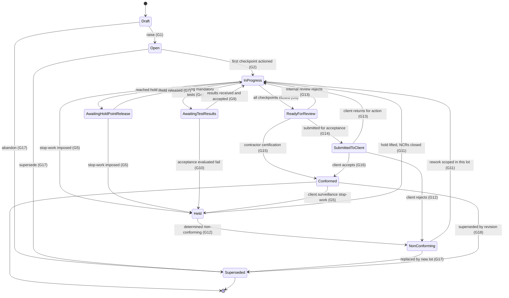
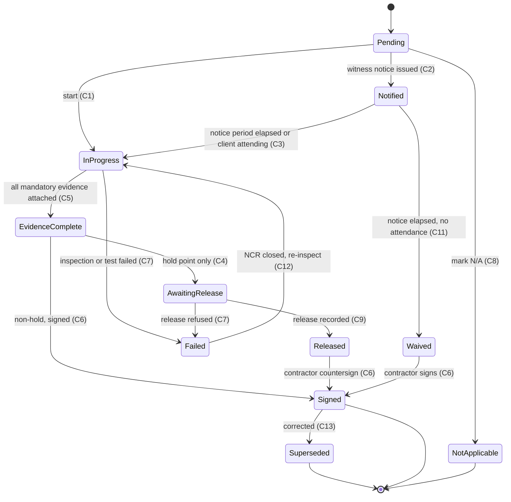
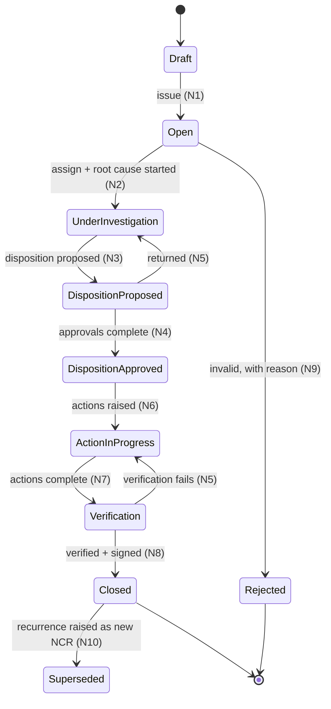
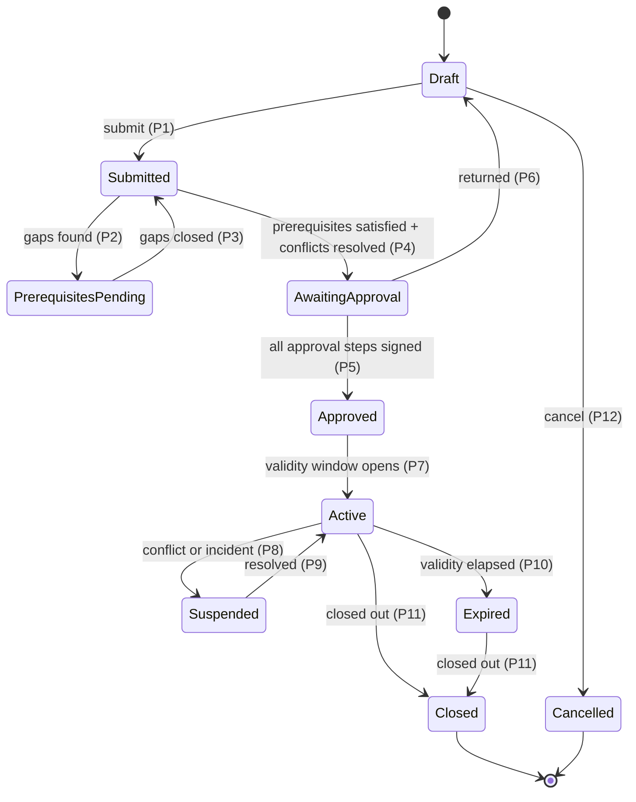
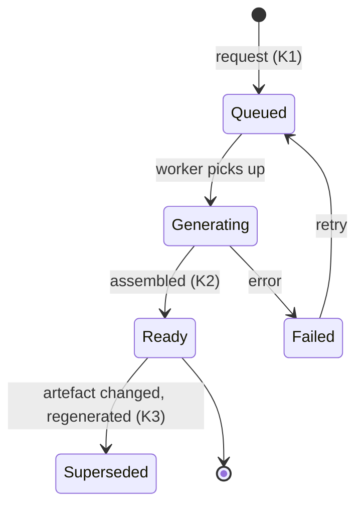
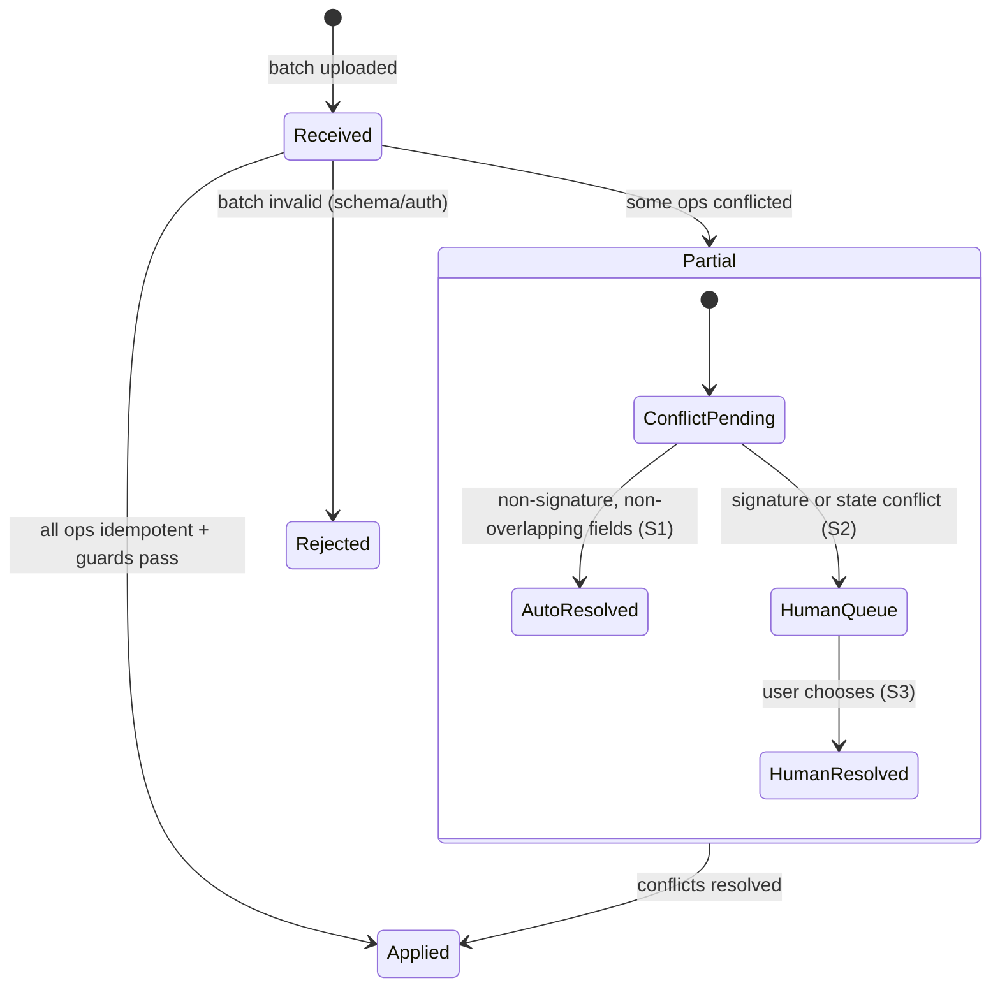

# 02 — State machines

**Status: revised at design review 1. Awaiting confirmation of the new material
flagged below, then implementation.**

Every transition below is implemented as a guarded function in the database, not
as a status column the application sets freely. `lot.status` and
`itp_checkpoint.state` are updatable **only** through `SECURITY DEFINER`
functions that evaluate the guards; direct `UPDATE ... SET status` is revoked
from the application role. This is what makes acceptance criterion §12.4
("prove it") provable at the SQL level rather than the UI level.

Guard notation: `G-n` identifiers are referenced from the tables under each
diagram and are testable one-for-one in the Vitest suite.

> **Revised in this pass:** hold and witness blocking are now structurally
> distinct (§4); the late-release path is modelled as a record, not a flag (§4.3);
> client lot acceptance is contract-configurable with three modes and defaults to
> not required (§1, G14–G16).

---

## 1. Lot lifecycle



**Client acceptance is not a state.** `Conformed` is reachable two ways — by
contractor certification (G15) or after client acceptance (G16) — depending on the
contract's acceptance mode. `client_accepted_at` and
`client_acceptance_signature_id` are **attributes of a conformed lot**, writable
once after the lot is already `Conformed` (G19). A Superintendent accepting a
batch of lots during surveillance three weeks later sets an attribute; it does not
move a lot through a state, and no lot ever waits in a queue for it.

### 1.1 Guard conditions

| ID | Transition | Guard — all conditions must hold |
|---|---|---|
| **G1** | `Draft → Open` | Actor holds `lot.raise` **in write scope** for the lot's zone/WBS. Lot has: `work_type_id`; non-null `geom` valid per `ST_IsValid` and within the project boundary; `chainage_range_m` inside the parent alignment's extent (after applying chainage equations) **or** the work type's `geometry_kind` does not require chainage; where the work type is RL-bearing, a `design_rl_m` with a non-null `vertical_datum_id` (§1.3); `quantity > 0` with a unit compatible with the work type; a `responsible_engineer_id` with an active `project_membership`; a generated `lot_number` unique in project. **An `itp_instance` has been snapshotted** from a `published` master version, its `content_hash` matching the source version's. |
| **G2** | `Open → In Progress` | ≥1 `itp_checkpoint` has left `pending`. System-triggered. |
| **G3** | `In Progress → Awaiting Hold Point Release` | ∃ checkpoint with `checkpoint_type='hold'` and `state='awaiting_release'` whose `sequence_no` is the lowest incomplete sequence. Set automatically by the checkpoint machine (C4). **Witness points never cause this transition** (§4.1). |
| **G4** | `In Progress → Awaiting Test Results` | ∃ `test_request` linked to a mandatory `checkpoint_evidence_req` with `status NOT IN ('complete','cancelled')`, and no unreleased hold at an earlier sequence (precedence, §1.2). |
| **G5** | `* → Held` | Actor holds `lot.hold.impose`. A `reason` is mandatory, written to `lot_state_event`. May be imposed from any state including `Conformed` — a client finding a defect during surveillance on an already-conformed lot is a real and important case, and it must not require superseding the lot to act on. |
| **G6** | `In Progress → Ready for Review` | **All** of: (a) every `itp_checkpoint` is `signed`, `waived` or `not_applicable`; (b) every mandatory `checkpoint_evidence_req` has `count(checkpoint_evidence) >= min_count`; (c) every `test_request` is `complete` or `cancelled` with a recorded reason; (d) every `lot_acceptance_evaluation` has `outcome='pass'` — `insufficient_samples` and `fail` both block; (e) no `ncr` against the lot with `status NOT IN ('closed','rejected','superseded')`; (f) every hold checkpoint has a `hold_release` (of any kind, §4.3); (g) surveyed quantity reconciles within project tolerance, or a variance note exists. **No role bypasses (a)–(f).** The only path past a failing condition is a `concession` linked to the specific failing subject, which sets `lot.conformance_qualifier='with_concession'`. |
| **G7** | `Awaiting Hold Point Release → In Progress` | The blocking checkpoint has a `hold_release` row satisfying §4.3. No further hold sits at an earlier incomplete sequence. |
| **G9** | `Awaiting Test Results → In Progress` | Every mandatory `test_request` is `complete`, and every applicable `lot_acceptance_evaluation` has `outcome='pass'`. |
| **G10** | `Awaiting Test Results → Held` | A `lot_acceptance_evaluation` returned `outcome='fail'`. System-triggered. Auto-creates an `ncr` in `open`, `origin='system'`, `triggering_test_result_id` set, severity *proposed* from the deviation magnitude, assigned to `lot.responsible_engineer_id`. A human confirms severity. |
| **G11** | `Held → In Progress` / `Non-Conforming → In Progress` | Every `ncr` against the lot is `closed`; every `correction` action complete with verification signature; any imposed stop-work explicitly lifted by a role on the same side as the imposer or higher. A client- or verifier-imposed hold is not liftable by any contractor role. |
| **G12** | `* → Non-Conforming` | Actor holds `lot.determine_non_conforming`. A linked `ncr` must exist. |
| **G13** | `Ready for Review` / `Submitted to Client → In Progress` | Rejection reason mandatory. Client-originated returns must link an `ncr` or `site_instruction`. |
| **G14** | `Ready for Review → Submitted to Client` | Only where `client_lot_acceptance_required(lot) = true` (§1.4). Actor holds `lot.submit`. A `conformance_pack` in `status='ready'` whose `manifest_hash` matches a freshly computed manifest — nothing changed since generation. A `lot_signature` with `purpose='conformance_statement'` exists. |
| **G15** | `Ready for Review → Conformed` | Only where `client_lot_acceptance_required(lot) = false`. Actor holds `lot.certify_conformance` (Engineering Manager, or a role the contract nominates). Same pack and manifest conditions as G14. This is the **default path**: the contractor certifies conformance and the client engages through hold points, witness points, surveillance and audit. |
| **G16** | `Submitted to Client → Conformed` | A `lot_signature` with `purpose='client_acceptance'` signed by a user whose read grant carries `side='client'`. Sets `client_accepted_at` in the same transaction. |
| **G19** | *(no state change)* `Conformed` + record client acceptance | Lot is `Conformed` with `client_accepted_at IS NULL`. Signer's `side='client'`, holds `lot.accept`. Writes `client_accepted_at` and `client_acceptance_signature_id` exactly once — a `NULL → value` transition only; `value → different value` is rejected. These two columns are the sole exception to the conformed lot's lock (see `04-rls-and-enforcement.md` §6). |
| **G17** | `* → Superseded` | `superseded_by_id` pointing at a replacement lot, plus a reason. Non-`Conformed` states only. |
| **G18** | `Conformed → Superseded` | Engineering Manager **and** client signature, a reason, and a replacement lot. A conformed lot is a delivered contractual artefact; superseding it is a formal act. |

On reaching `Conformed`, the lot and its evidence graph lock (`locked_at` set on
lot, ITP instance, checkpoints, signatures, pack) — except the two client
acceptance columns, and except supersession fields.

### 1.2 Status precedence

Several conditions can hold at once. Display precedence, highest first:

`Held` → `Awaiting Hold Point Release` → `Awaiting Test Results` → `In Progress`

The stored `status` follows this precedence; the underlying conditions are all
independently queryable, so the ageing views in §5.1 of the brief do not depend on
the displayed status.

### 1.3 RL is an attribute with a named datum

Any reduced level anywhere in the system is a **pair**: `<name>_rl_m numeric(9,3)`
and `vertical_datum_id` referencing the `vertical_datum` table, with

```sql
CHECK ((rl_m IS NULL) = (vertical_datum_id IS NULL))
```

so an RL without a named datum cannot be stored. RL is never carried inside the
canonical geometry — `lot.geom` is 2D by construction (ADR-0018). Guards that
compare levels (layer thickness, design vs surveyed deviation) reject a comparison
across two different `vertical_datum_id` values rather than silently arithmetic
on them.

### 1.4 `client_lot_acceptance_required(lot)`

```
contract.client_lot_acceptance_mode:
  'not_required'          -> false                         (DEFAULT)
  'nominated_work_types'  -> lot.work_type_id IN
                             (SELECT work_type_id FROM contract_acceptance_work_type
                              WHERE contract_id = ...)
  'all'                   -> true
```

Evaluated at G6, so the lot's onward path is known the moment it is ready. The
mode is a contract attribute, changeable only by a Quality Manager with the change
audited; changing it does not retro-move lots already `Conformed`.

---

## 2. Checkpoint lifecycle



### 2.1 Guard conditions

| ID | Transition | Guard |
|---|---|---|
| **C1** | `Pending → In Progress` | **The blocking check (§4) passes.** Actor is on the checkpoint's `responsible_party` side, holds `checkpoint.action`, and has **write scope** covering the lot's zone/WBS or the checkpoint's `subcontract_package_id`. Type is not `witness` with unissued notice. |
| **C2** | `Pending → Notified` | Type is `witness`. Creates a `witness_notification` with `notified_at = now()`, `required_notice_hours = checkpoint.notice_hours` (copied from the locked instance, not settable), `scheduled_inspection_at >= notified_at + notice_hours`. Locked on insert. |
| **C3** | `Notified → In Progress` | `now() >= scheduled_inspection_at` **or** client recorded `outcome='attended'`. Sets `notice_satisfied_at`. |
| **C4** | `Evidence Complete → Awaiting Release` | **Type is `hold`.** Sets `is_blocking = true`, cascades the lot to `Awaiting Hold Point Release` (G3), notifies holders of `release_role_id`. A witness checkpoint can never enter this state — enforced by CHECK, §4.1. |
| **C5** | `In Progress → Evidence Complete` | For every mandatory `checkpoint_evidence_req`: `count(checkpoint_evidence WHERE requirement_id = req.id) >= req.min_count`. Where the requirement names a `test_method_id`, the attached `test_result` must have `outcome='pass'` and a non-null `nata_accreditation_no` where `test_method.nata_required`. |
| **C6** | `→ Signed` | A `signature` row with `subject_type='itp_checkpoint'`, `subject_id = this.id`, and `subject_hash` equal to the canonical hash of the evidence manifest at signing time. Signer holds `checkpoint.sign`, is not a Cadet for `hold`/`witness` types, and satisfies the authentication strength rule (§7). Sets `locked_at`. |
| **C7** | `→ Failed` | Reason mandatory. Auto-creates a linked `ncr` in `draft`, pre-populated. |
| **C8** | `Pending → Not Applicable` | Requires `checkpoint.mark_not_applicable` (EM or QM only) plus written justification. For `hold` and `witness` types, additionally requires client acknowledgement — a contractor cannot unilaterally delete a client's inspection right. |
| **C9** | `Awaiting Release → Released` | A `hold_release` row satisfying §4.3, of any `release_kind`. The signer must hold the checkpoint's `release_role_id` and be on the matching side, **for every kind including retrospective** — lateness never relaxes who may release. |
| **C11** | `Notified → Waived` | `now() >= notified_at + required_notice_hours` **and** `now() >= scheduled_inspection_at` **and** `outcome='pending'` **and** ≥1 `notification_delivery` reached `sent`/`delivered`/`read`. A bounced notice does not start the clock. Sets `outcome='waived_non_attendance'`. **Witness only — `waived` is not a reachable state for a hold checkpoint.** |
| **C12** | `Failed → In Progress` | Linked NCR `closed` with verified corrective action. Increments `reinspection_count`, feeding the first-time-right metric. |
| **C13** | `Signed → Superseded` | The correction path (§4.4). Requires `checkpoint.correct` (Quality Manager), a `checkpoint_correction` record with a reason, and a `signature_withdrawal` for each signature being set aside. Creates a replacement checkpoint row at the same `sequence_no` in the same instance. **The original row, its signatures and its evidence are all retained.** |

---

## 3. Witness point notice clock

Modelled explicitly rather than as flags, because this is what gets argued about in
claims.


Invariants:

1. **A witness point never blocks.** Work proceeds once the notice period has
   elapsed, whether the client attends, declines or ignores it. There is no state
   in which an unactioned witness point stops a downstream checkpoint. This is
   enforced structurally, not by convention — see §4.1.
2. `witness_notification` rows are insert-only. A rescheduled inspection creates a
   **new** row; the original notice and its unmet outcome stay in the record.
3. The waiver is computed from `notified_at + required_notice_hours` and the
   delivery receipt, never from when a user pressed a button.
4. `required_notice_hours` is copied from the locked ITP instance and cannot be
   shortened.

---

## 4. Blocking — the enforcement mechanism

Acceptance criterion §12.4 requires proof that checkpoint 6 cannot be actioned
while checkpoint 5 (a hold) is unreleased. The proof is a database constraint,
reachable from any client including `psql`.

### 4.1 Only hold points block — structurally

Two mechanisms, so this cannot drift:

```sql
-- On itp_master_checkpoint AND itp_checkpoint:
CONSTRAINT only_holds_block
  CHECK (blocking_scope = 'none' OR checkpoint_type = 'hold')
```

A witness, surveillance, review or record checkpoint **cannot be given a blocking
scope**, at any level, by any author, in the master library or in an instance. A
Quality Manager who believes a witness point should stop work has to model it as a
hold point, which is the correct thing to do and is visible to the client as such.

The blocking predicate then filters on `checkpoint_type = 'hold'` as well, so the
behaviour is correct even if the constraint were ever dropped:

```sql
CREATE FUNCTION itp_blocking_predecessor(p_checkpoint_id uuid) RETURNS uuid
LANGUAGE sql STABLE AS $$
  SELECT c.id
  FROM itp_checkpoint c
  JOIN itp_checkpoint target ON target.id = p_checkpoint_id
  WHERE c.itp_instance_id  = target.itp_instance_id
    AND c.sequence_no      < target.sequence_no
    AND c.checkpoint_type   = 'hold'          -- witness/surveillance/review/record never block
    AND c.blocking_scope    = 'all_subsequent'
    AND c.superseded_by_id IS NULL            -- a corrected checkpoint is not a predecessor
    AND NOT itp_checkpoint_cleared(c.id)      -- §4.3
  ORDER BY c.sequence_no
  LIMIT 1;
$$;
```

### 4.2 Where the block is applied

- `BEFORE UPDATE` on `itp_checkpoint` — raises `LOTLINE_HOLD_POINT_BLOCKED` when
  `itp_blocking_predecessor(NEW.id)` is non-null, for any transition other than
  into `not_applicable` (guard C8) or `failed`.
- `BEFORE INSERT` on `checkpoint_evidence` — so evidence cannot be pre-loaded
  against a blocked checkpoint to make the block look released.

There is **no role, permission, flag or environment variable** that suppresses
either trigger.

### 4.3 Clearance is a record — the three release kinds

The trigger does not consult a status or a flag. It asks whether a **signed
clearance record exists**:

```sql
CREATE FUNCTION itp_checkpoint_cleared(p_checkpoint_id uuid) RETURNS boolean
LANGUAGE sql STABLE AS $$
  SELECT EXISTS (
    SELECT 1 FROM hold_release hr
    WHERE hr.itp_checkpoint_id = p_checkpoint_id
      AND hr.signature_id     IS NOT NULL
      AND hr.superseded_by_id IS NULL
  )
  OR EXISTS (
    SELECT 1 FROM itp_checkpoint c
    WHERE c.id = p_checkpoint_id AND c.state = 'not_applicable'   -- guard C8
  );
$$;
```

`hold_release` carries a `release_kind` and exactly one supporting record:

| `release_kind` | Supporting record | When it is used | Signature requirement |
|---|---|---|---|
| `standard` | none | The hold was released before work proceeded past it. The normal case. | Nominated `release_role_id`, matching side |
| `concession` | `concession_id` NOT NULL | The hold cannot be released on its merits and the work is being authorised to proceed anyway under a documented exception. | Engineering Manager signature, plus client signature where the hold is client-nominated |
| `retrospective` | `retrospective_release_id` NOT NULL | Work physically proceeded past the point and the release is being recorded after the fact. | Nominated `release_role_id`, matching side — **identical to `standard`** |

```sql
CONSTRAINT release_kind_has_its_record CHECK (
  (release_kind = 'standard'      AND concession_id IS NULL AND retrospective_release_id IS NULL)
  OR (release_kind = 'concession'    AND concession_id IS NOT NULL)
  OR (release_kind = 'retrospective' AND retrospective_release_id IS NOT NULL)
)
```

All three require `signature_id IS NOT NULL`. All three appear on the conformance
pack. None of them is a flag, and none of them relaxes *who* may release.

#### `retrospective_release`

This is the honest model of a real event: the work went past the hold point on
site, and the record has to catch up. Note that the trigger was never bypassed —
the block held, the *site* moved on, and the system is now being reconciled with
what happened.

Required fields:

| Field | Purpose |
|---|---|
| `work_proceeded_at` | When work actually passed the point. Defaulted from the earliest subsequent checkpoint activity or evidence timestamp, overridable with a reason. |
| `released_at`, `signature_id` | The release itself, by the nominated party on the correct side. |
| `retrospective_lag` | Generated: `released_at - work_proceeded_at`. Reported and trended. |
| `discovery_method` | `self_identified` / `internal_audit` / `client_surveillance` / `verifier_audit` / `system_reconciliation` |
| `verification_basis` | `contemporaneous_evidence` / `physical_reinspection` / `destructive_verification` / `none` — **how the releasing party satisfied themselves the work was conforming at the time they could no longer see it.** |
| `verification_evidence` | Links to the photos, survey, test results or reinspection record relied on. Mandatory unless `verification_basis = 'none'`. |
| `justification` | Free text, mandatory. |
| `raised_ncr_id` | The process NCR (below). |

**A retrospective release always raises an NCR.** Proceeding past an unreleased
hold point is a process non-conformance under any QMS, and an ISO 9001 or client
system auditor expects to find it in the register. Proposed severity:

- `minor` where `verification_basis` is `contemporaneous_evidence` or
  `physical_reinspection`
- `major` where `destructive_verification` was needed, or `verification_basis = 'none'`

Severity is *proposed*; a human confirms it. `retrospective_lag` and
`discovery_method` feed the trend engine — a crew that repeatedly outruns its hold
points is a leading indicator, and this makes it visible rather than invisible.

> **New material — please confirm.** The automatic process NCR is my call, not
> something you specified. It is the honest reading of a QMS, but it does add a
> register entry every time. The alternative is a contract-configurable switch.
> Say which you want.

### 4.4 Correcting a mis-signed checkpoint

Signed rows are locked and signatures are immutable (ADR-0003), so correction is
supersession, never mutation:

1. Quality Manager creates a `checkpoint_correction` with a reason and a
   `correction_kind` (`wrong_checkpoint_signed`, `wrong_signatory`,
   `incorrect_evidence_attached`, `data_entry_error`).
2. A `signature_withdrawal` is written for each signature being set aside — itself
   signed by the QM, with a reason. **The original signature row is not deleted or
   altered.** It remains in the record as something that happened and was later
   withdrawn, which is what an auditor needs to see.
3. The original checkpoint row gets `superseded_by_id` set. It leaves the blocking
   predicate (which filters `superseded_by_id IS NULL`) and leaves the "current"
   view, but stays queryable and stays in the conformance pack's audit appendix.
4. A replacement `itp_checkpoint` row is created at the same `sequence_no`, in
   state `pending`, carrying `source_checkpoint_id` from the same master
   checkpoint and `corrected_from_id` pointing at the superseded row.
5. **If the corrected checkpoint is a hold, it re-blocks immediately** — its
   replacement has no `hold_release`, so `itp_checkpoint_cleared()` is false and
   every subsequent checkpoint is blocked again until it is properly released. A
   correction cannot be used to launder a hold point.

A partial unique index `(itp_instance_id, sequence_no) WHERE superseded_by_id IS
NULL` keeps exactly one live checkpoint per sequence.

### 4.5 Tests

All at SQL level, run as `lotline_app`, no application process involved:

| # | Assertion |
|---|---|
| T1 | With cp5 (hold) unreleased, `action_checkpoint(cp6)` raises `LOTLINE_HOLD_POINT_BLOCKED`. |
| T2 | With cp5 unreleased, `INSERT INTO checkpoint_evidence` against cp6 raises the same. |
| T3 | After a `standard` release of cp5 by the nominated party, `action_checkpoint(cp6)` succeeds. |
| T4 | **A `witness` checkpoint at sequence 5, in any state including `pending` and `notified`, does not block cp6.** |
| T5 | `UPDATE itp_master_checkpoint SET blocking_scope='all_subsequent'` on a witness checkpoint is rejected by `only_holds_block`. |
| T6 | A `concession` release clears the block, and the concession appears in the lot's pack manifest. |
| T7 | A `retrospective_release` clears the block, and a process NCR exists against the lot. |
| T8 | A retrospective release signed by a user *not* holding `release_role_id`, or on the wrong side, is rejected. |
| T9 | After correcting a released hold checkpoint (C13), cp6 is blocked again. |
| T10 | A `hold_release` row with `signature_id IS NULL` does not clear the block. |
| T11 | `waived` is unreachable for a `hold` checkpoint. |

---

## 5. NCR lifecycle



| ID | Guard |
|---|---|
| **N1** | Description, severity, origin, and either a `lot_id` or geometry present. `ncr_number` allocated. Client- and verifier-origin NCRs may only be issued by users on the matching side. System-origin NCRs (G10, retrospective release) are created in `open` directly. |
| **N2** | `assigned_to` set to a user with an active membership and write scope covering the subject. |
| **N3** | ≥1 `ncr_five_why` level completed. `rework` / `reject_and_remove` need a method statement; `repair` / `use_as_is` additionally need a `concession` at `requested` or beyond. |
| **N4** | Engineering Manager signature. For `repair` / `use_as_is`, the linked `concession` must be `client_approved`. Where `cost_amount` exceeds the approver's `constraint_json.max_cost_impact`, escalates to Project Director. |
| **N5** | Reason mandatory. |
| **N6** | ≥1 `correction` action with owner and due date. Preventive action mandatory for `major` and `critical`. |
| **N7** | All actions have `completed_at`. Physical corrections require an attached retest or re-inspection record. |
| **N8** | Verification signature by someone other than the action owner. Client- and verifier-origin NCRs additionally require a client/IV signature. Sets `closed_at`, locks the NCR. |
| **N9** | Rejection reason mandatory. A contractor rejecting a client-raised NCR needs a client counter-signature. |
| **N10** | Recurrence creates a new NCR linked by `predecessor_ncr_id`; a closed NCR is never reopened in place. |

---

## 6. Permit lifecycle



| ID | Guard |
|---|---|
| **P1** | `authorised_area` present and valid where `permit_type.requires_geometry`; where the type has a depth limit, `depth_limit_rl_m` with a named `vertical_datum_id`; `validity` duration ≤ `max_duration_hours`; responsible supervisor nominated. |
| **P2** | Any mandatory prerequisite unsatisfied, older than `max_age_days`, or whose `evidence_expires_on` falls inside the validity window. A DBYD certificate expiring mid-permit fails here — the most common real-world gap. |
| **P3** | All gaps satisfied, `verified_by` set by someone other than the requester. |
| **P4** | **Conflict detection has run and every blocking `permit_conflict_detection` is resolved.** Query: conflicting-type permits with `ST_DWithin(a.authorised_area, b.authorised_area, buffer_m)`, `a.validity && b.validity`, `b.status IN ('approved','active')`. Resolution is geometry amendment, time separation, or a signed WHS override with justification. |
| **P5** | Every `permit_type_approval_step` has an approval with `decision='approved'` and, where required, a signature. Approver holds the step's role and, for high-risk types, a current `competency_record`. |
| **P7** | System transition at `lower(validity)`. Re-runs conflict detection; a new blocking conflict sends it to `Suspended`, not `Active`. |
| **P8** | WHS or Construction Manager; reason mandatory; all signed-on personnel notified. |
| **P10** | System transition at `upper(validity)`. Anyone still signed on triggers an alert — an expired permit with people under it is an incident, not a tidy-up. |
| **P11** | All `permit_signon` rows have `signed_off_at`. `permit_closeout` with signature and site condition note. |

---

## 7. Authentication strength required per action

Resolved from OQ-8/OQ-12. `signature.authentication_event_id` links every
signature to the unlock that authorised it, so the chain is auditable end to end.

| Action | Minimum authentication |
|---|---|
| Read, filter, export a register | Active session |
| Photo capture, docket upload, diary entry, checkpoint evidence attach | Active session — including a device-bound session unlocked by PIN |
| Sign a `record` / `surveillance` / `review` checkpoint | Session with a per-user unlock on the current device |
| Sign a `witness` checkpoint, complete an inspection | Passkey assertion, or full IdP session |
| **Release a hold point** (any kind, including retrospective) | **Step-up: passkey assertion or IdP re-authentication.** A device PIN is never sufficient. |
| Certify lot conformance (G15) | Step-up |
| Client lot acceptance (G16, G19) | Step-up |
| Approve a concession, withdraw a signature, override a permit conflict | Step-up |
| Role or permission changes, API key issue | Step-up + full IdP session (never available on a device-bound session) |

A device-bound session is capability-restricted regardless of the user's role: no
role management, no permission grants, no data export, no API key access. A
Quality Manager signed in on a shared site tablet holds their field permissions
and nothing else.

---

## 8. Conformance pack generation



| ID | Guard |
|---|---|
| **K1** | Lot is `Ready for Review` or later. Manifest computed and hashed: every checkpoint, test result, survey conformance, docket, photo, NCR, concession, retrospective release and document revision linked to the lot, each pinned by `sha256`. Any `document_revision` with `scan_status != 'clean'` **aborts** generation — an unscanned file never reaches a client. |
| **K2** | Every manifest item has a `pdf_render_key`, or is a system-generated section. Assembly is merge + cover + index + bookmark tree + page numbering + watermark. Target p95 < 10 s. Records `generation_ms`. |
| **K3** | Any change to a manifest subject marks the pack `superseded` and queues a regeneration. A pack already submitted to the client is never mutated; the new pack is `revision_no + 1`. |

The pack's ITP section renders every checkpoint including superseded ones, and its
appendix carries every concession, retrospective release and signature withdrawal
against the lot. A lot that got to `Conformed` the hard way says so on the paper.

---

## 9. Offline sync conflict resolution



| ID | Guard |
|---|---|
| **S1** | Auto-resolution only where: the operation is not a `sign`; server and client changed disjoint fields; and the target's state machine still admits the transition. Otherwise S2. |
| **S2** | Any of: two signatures on one subject from different users; a signature whose `subject_hash` no longer matches; a transition whose guard now fails — including a hold imposed, or a hold point that became blocking, while the device was offline. Raises `sync_conflict` to the submitting user **and** the lot's responsible engineer. Last-write-wins is never applied to a signature. |
| **S3** | Resolution is an explicit, audited user act, retaining both values. Discarding a field-captured signature requires a reason. |

A device that was offline when a hold point went unreleased will find its queued
downstream checkpoint operations rejected on sync, not silently applied. That
rejection is the normal trigger for a `retrospective_release` (§4.3) — the work
happened, the record catches up, and the catching-up is itself a record.
