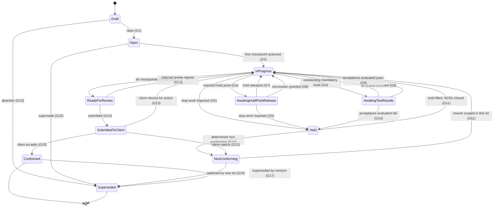
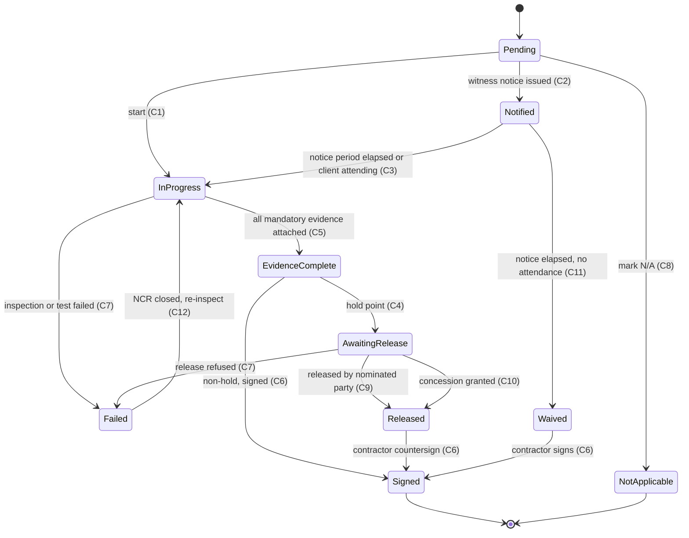
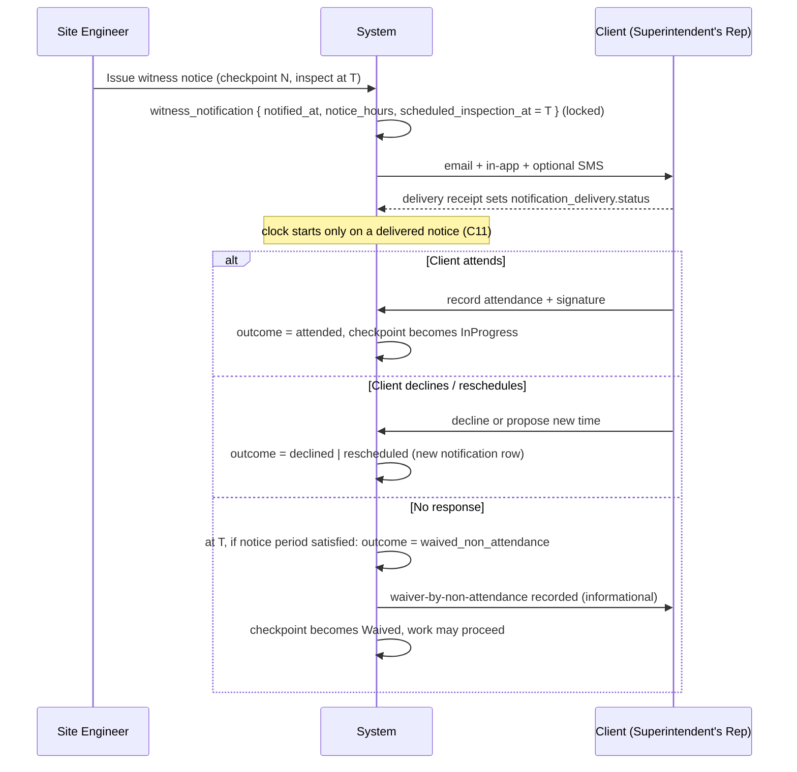
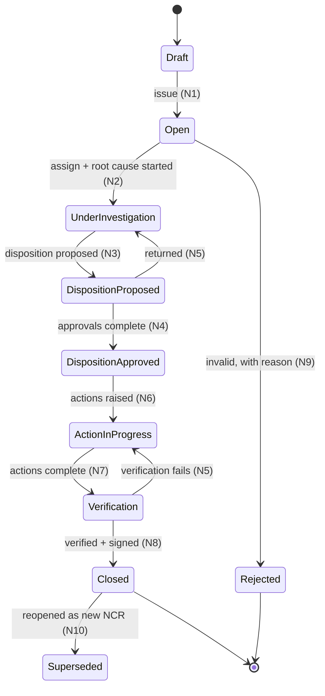
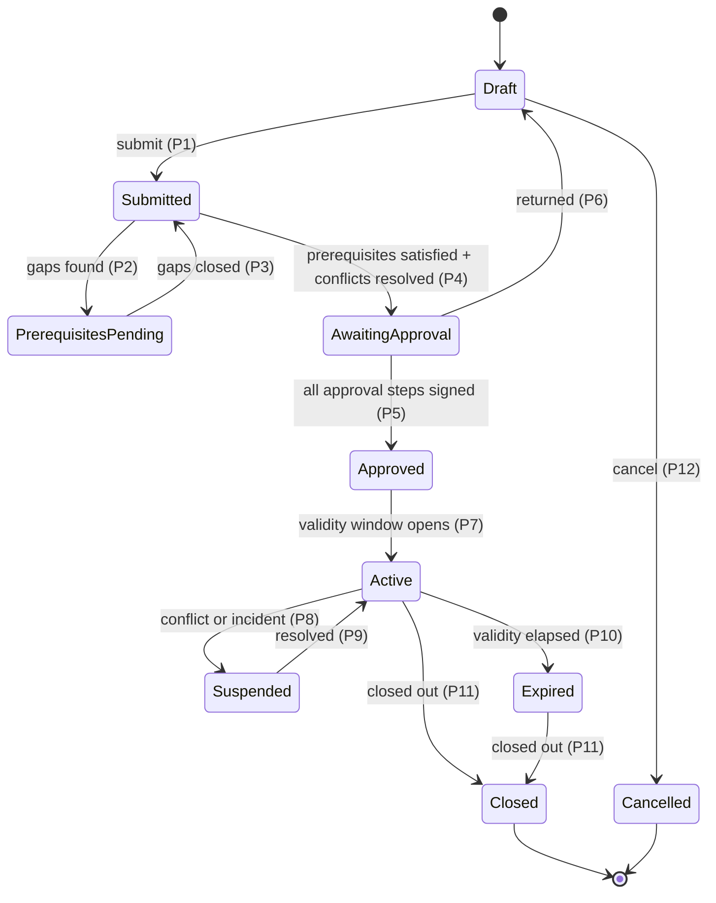
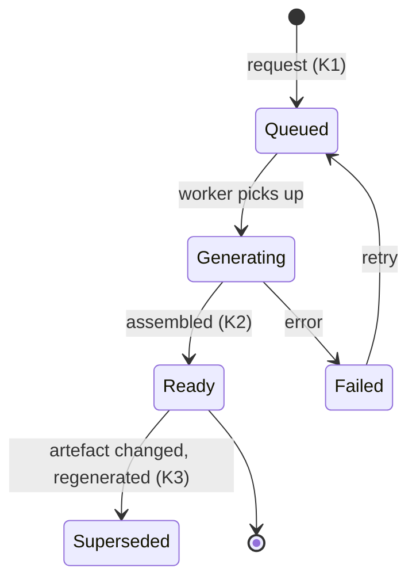
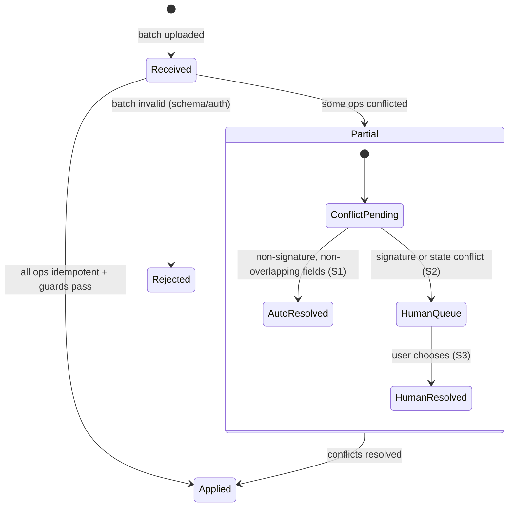

# 02 — State machines

**Status: proposed, awaiting review.**

Every transition below is implemented as a guarded function in the database, not
as a status column the application sets freely. `lot.status` and
`itp_checkpoint.state` are updatable **only** through `SECURITY DEFINER`
functions that evaluate the guards; direct `UPDATE ... SET status` is revoked
from the application role. This is what makes acceptance criterion §12.4
("prove it") provable at the SQL level rather than the UI level.

Guard notation: `G-n` identifiers are referenced from the tables under each
diagram and are testable one-for-one in the Vitest suite.

---

## 1. Lot lifecycle



### 1.1 Guard conditions

| ID | Transition | Guard — all conditions must hold |
|---|---|---|
| **G1** | `Draft → Open` | Actor holds `lot.raise` in scope. Lot has: `work_type_id`; non-null `geom` valid per `ST_IsValid` and within the project boundary; `chainage_range_m` inside the parent alignment's extent (after applying chainage equations) **or** the work type's `geometry_kind` does not require chainage; `quantity > 0` with a unit compatible with the work type; a `responsible_engineer_id` who holds an active `project_membership`; a generated `lot_number` unique in project. **An `itp_instance` has been snapshotted** from a `published` master version, and its `content_hash` matches the source version's. |
| **G2** | `Open → In Progress` | ≥1 `itp_checkpoint` has left `pending`. System-triggered, not a user action. |
| **G3** | `In Progress → Awaiting Hold Point Release` | ∃ checkpoint with `checkpoint_type='hold'` and `state='awaiting_release'` whose `sequence_no` is the lowest incomplete sequence. Set automatically by the checkpoint machine (§2, C4). |
| **G4** | `In Progress → Awaiting Test Results` | ∃ `test_request` linked to a mandatory `checkpoint_evidence_req` with `status NOT IN ('complete','cancelled')`, **and** no unreleased hold blocks an earlier sequence (a hold takes precedence in the status display). |
| **G5** | `* → Held` | Actor holds `lot.hold.impose` (Construction Manager, Quality Manager, Superintendent's Rep, IV). A `reason` is mandatory and is written to `lot_state_event`. May be imposed from any non-terminal state. |
| **G6** | `In Progress → Ready for Review` | **All** of: (a) every `itp_checkpoint` is in `signed`, `waived`, or `not_applicable`; (b) every `mandatory` `checkpoint_evidence_req` has `count(checkpoint_evidence) >= min_count`; (c) every `test_request` on the lot is `complete` **or** `cancelled` with a recorded reason; (d) every `lot_acceptance_evaluation` for the lot has `outcome='pass'` — an `insufficient_samples` or `fail` outcome blocks; (e) no `ncr` against the lot with `status NOT IN ('closed','rejected','superseded')`; (f) every `hold_release` required is present and signed; (g) `quantity` reconciles to the surveyed quantity within the project tolerance, or a variance note exists. **There is no role that can bypass (a)–(f).** The only path past a failing condition is a `concession` in status `client_approved` (or `em_approved` where the contract does not require client concurrence), linked to the specific failing subject — which itself sets `lot.conformance_qualifier='with_concession'`. |
| **G7** | `Awaiting Hold Point Release → In Progress` | The blocking checkpoint has a `hold_release` row with a valid `signature_id` whose signer holds the checkpoint's `release_role_id` and whose `project_membership.side` matches the checkpoint's `responsible_party`. No further hold sits at an earlier incomplete sequence. |
| **G8** | `Awaiting Hold Point Release → In Progress` (concession path) | A `concession` exists for this checkpoint with `status IN ('em_approved','client_approved')`, an attached document, and an Engineering Manager signature. Writes `hold_release` with `concession_id` set. **This is the only bypass of a hold point in the system, and it is a signed, documented record.** |
| **G9** | `Awaiting Test Results → In Progress` | Every mandatory `test_request` is `complete`, and every applicable `lot_acceptance_evaluation` has `outcome='pass'`. |
| **G10** | `Awaiting Test Results → Held` | A `lot_acceptance_evaluation` returned `outcome='fail'`. System-triggered. Auto-creates an `ncr` in `open` with `origin='system'`, `triggering_test_result_id` set, severity proposed from the deviation magnitude, assigned to `lot.responsible_engineer_id`. Severity is *proposed*; a human confirms it. |
| **G11** | `Held → In Progress` / `NonConforming → In Progress` | Every `ncr` against the lot is `closed`; every `ncr_action` of type `correction` is complete with verification signature; any imposed stop-work has an explicit lift by a user holding `lot.hold.lift` at or above the imposing authority's side (a client-imposed hold cannot be lifted by the contractor). |
| **G12** | `* → Non-Conforming` | Actor holds `lot.determine_non_conforming` (Engineering Manager, Superintendent's Rep, IV). An `ncr` must exist and be linked. |
| **G13** | `ReadyForReview / SubmittedToClient → In Progress` | Rejection reason mandatory; recorded as `lot_state_event.reason` and, where client-originated, an `ncr` or `site_instruction` must be linked. |
| **G14** | `Ready for Review → Submitted to Client` | Actor holds `lot.submit`. A `conformance_pack` exists in `status='ready'` whose `manifest_hash` matches a freshly computed manifest — i.e. nothing has changed since generation. A signed `lot_signature` with `purpose='conformance_statement'` exists. |
| **G15** | `Submitted to Client → Conformed` | A `lot_signature` with `purpose='client_acceptance'` signed by a user whose `access_grant.side='client'`. On success the lot and its entire evidence graph are locked (`locked_at` set on lot, ITP instance, checkpoints, signatures, pack). |
| **G16** | `* → Superseded` | A `superseded_by_id` pointing at another lot, plus `supersede_reason`. Only from non-`Conformed` states via this guard. |
| **G17** | `Conformed → Superseded` | Requires Engineering Manager **and** client signature, a reason, and a replacement lot. A conformed lot is a delivered contractual artefact; superseding it is a formal act, not a correction. |

### 1.2 Status precedence

Several conditions can be true at once (a lot can have an unreleased hold *and*
outstanding tests). Display precedence, highest first:

`Held` → `Awaiting Hold Point Release` → `Awaiting Test Results` → `In Progress`

The stored `status` follows this precedence; the underlying conditions are all
independently queryable, so the ageing views in §5.1 do not depend on the
displayed status.

---

## 2. Checkpoint lifecycle



### 2.1 Guard conditions

| ID | Transition | Guard |
|---|---|---|
| **C1** | `Pending → In Progress` | **The blocking check (§4) passes.** Actor is in the checkpoint's `responsible_party` side and holds `checkpoint.action` within the lot's zone/package scope. Checkpoint type is not `witness` with unissued notice. |
| **C2** | `Pending → Notified` | Type is `witness`. A `witness_notification` row is created with `notified_at = now()`, `required_notice_hours = checkpoint.notice_hours`, `scheduled_inspection_at >= notified_at + notice_hours`. Notification deliveries are queued to every client contact on the distribution list; the row is locked on insert. |
| **C3** | `Notified → In Progress` | `now() >= scheduled_inspection_at` **or** the client has recorded `outcome='attended'`. Sets `notice_satisfied_at`. |
| **C4** | `EvidenceComplete → AwaitingRelease` | Type is `hold`. Sets `is_blocking = true` and cascades the lot to `Awaiting Hold Point Release` (G3). Notifies the `release_role_id` holders. |
| **C5** | `InProgress → EvidenceComplete` | For every `checkpoint_evidence_req` with `mandatory = true`: `count(checkpoint_evidence WHERE requirement_id = req.id) >= req.min_count`. Where the requirement names a `test_method_id`, the attached `test_result` must have `outcome='pass'` and a non-null `nata_accreditation_no` where `test_method.nata_required`. |
| **C6** | `→ Signed` | A `signature` row exists with `subject_type='itp_checkpoint'`, `subject_id = this.id`, and `subject_hash` equal to the canonical hash of the checkpoint's evidence manifest at time of signing. Signer holds `checkpoint.sign` and is **not** a Cadet/Undergraduate role for hold or witness types. Sets `locked_at`. |
| **C7** | `→ Failed` | Reason mandatory. Auto-creates a linked `ncr` in `draft` pre-populated from the checkpoint. |
| **C8** | `Pending → NotApplicable` | Requires `checkpoint.mark_not_applicable` (Engineering Manager or Quality Manager only) plus a written justification. For `hold` and `witness` types this additionally requires client acknowledgement — a contractor cannot unilaterally delete a client's inspection right. |
| **C9** | `AwaitingRelease → Released` | Signer's active role is in `release_role_id`, **and** signer's `access_grant.side` matches the checkpoint's `responsible_party` (a contractor cannot release a client hold point). `delegation.signature_delegable` is irrelevant here — hold release is never delegable. Writes `hold_release` + `signature`. |
| **C10** | `AwaitingRelease → Released` (concession) | Per G8. `hold_release.concession_id` non-null. |
| **C11** | `Notified → Waived` | `now() >= notified_at + required_notice_hours` **and** `now() >= scheduled_inspection_at` **and** `witness_notification.outcome = 'pending'` **and** at least one `notification_delivery` for that notification reached `status IN ('sent','delivered','read')`. A notice that bounced does not start the clock. Sets `outcome='waived_non_attendance'`, `outcome_at = now()`. Evaluated by a scheduled job; the resulting record is the auditable waiver evidence. **Waiver applies only to `witness` type. A hold point never auto-waives.** |
| **C12** | `Failed → InProgress` | The linked NCR is `closed` with verified corrective action. Increments a `reinspection_count` used by the first-time-right metric. |

---

## 3. Witness point notice clock

This is the sequence that gets argued about in claims, so it is modelled
explicitly rather than as flags.



Invariants:

1. `witness_notification` rows are insert-only. A rescheduled inspection creates
   a **new** row; the original notice and its unmet outcome stay in the record.
2. The waiver is computed from `notified_at + required_notice_hours` and the
   delivery receipt, never from when a user pressed a button.
3. Shortening `required_notice_hours` below the checkpoint's snapshotted
   `notice_hours` is not possible — the value is copied from the locked ITP
   instance.

---

## 4. Hold point blocking — the enforcement mechanism

Acceptance criterion §12.4 requires proof that checkpoint 6 cannot be actioned
while checkpoint 5 (a hold) is unreleased. The proof is a database constraint,
reachable by any client including `psql`.

```
FUNCTION itp_blocking_predecessor(p_checkpoint_id uuid) RETURNS uuid

  SELECT c.id
  FROM itp_checkpoint c
  WHERE c.itp_instance_id = (target.itp_instance_id)
    AND c.sequence_no     <  target.sequence_no
    AND c.checkpoint_type  = 'hold'
    AND c.blocking_scope   = 'all_subsequent'
    AND c.state NOT IN ('released','signed','waived','not_applicable')
  ORDER BY c.sequence_no
  LIMIT 1;
```

- A `BEFORE UPDATE` trigger on `itp_checkpoint` raises
  `LOTLINE_HOLD_POINT_BLOCKED` if `itp_blocking_predecessor(NEW.id)` is non-null
  and the transition is anything other than into `not_applicable` (which has its
  own guard C8) or into `failed`.
- The same predicate blocks `checkpoint_evidence` inserts against a blocked
  checkpoint, so evidence cannot be pre-loaded to make the block look released.
- There is **no role, permission, or flag** that suppresses the trigger. The only
  way past is C10 — a `concession`, which changes the predecessor's state to
  `released` by writing a signed `hold_release`, leaving the concession in the
  record and on the conformance pack.
- Test: as a Site Engineer session, `SELECT lotline.action_checkpoint(<cp6>)`
  must raise `LOTLINE_HOLD_POINT_BLOCKED`. As a Superintendent's Rep, release
  cp5, then the same call must succeed. Both assertions live in the SQL-level
  test suite, not the UI suite.

---

## 5. NCR lifecycle



| ID | Guard |
|---|---|
| **N1** | Description, severity, origin, and either a `lot_id` or geometry present. `ncr_number` allocated. Client- and verifier-origin NCRs may only be issued by users whose `access_grant.side` matches. |
| **N2** | `assigned_to` set to a user with an active membership. |
| **N3** | `ncr_five_why` has ≥1 level completed. A disposition of `rework` or `reject_and_remove` needs a method statement document; `repair` and `use_as_is` additionally need a `concession` in `requested` or beyond. |
| **N4** | Engineering Manager signature present. For `repair` / `use_as_is`, the linked `concession` must be `client_approved`. For `cost_amount > role_permission.constraint_json.max_cost_impact` of the approver, escalates to Project Director. |
| **N5** | Reason mandatory. |
| **N6** | ≥1 `ncr_action` of type `correction` with an owner and due date. Preventive action is mandatory for `major` and `critical`. |
| **N7** | All actions have `completed_at`. Where correction was physical work, a retest or re-inspection record is attached. |
| **N8** | Verification signature by someone other than the action owner (segregation). For client- or verifier-origin NCRs, closure additionally requires a client/IV signature. Sets `closed_at`, locks the NCR. |
| **N9** | Rejection reason mandatory; visible to the raiser; client-raised NCRs cannot be rejected by the contractor without a client counter-signature. |
| **N10** | Recurrence creates a new NCR linked via `superseded_by_id` in reverse (`predecessor_ncr_id`); the closed NCR is never reopened in place. |

---

## 6. Permit lifecycle



| ID | Guard |
|---|---|
| **P1** | `authorised_area` present and valid where `permit_type.requires_geometry`; `validity` duration ≤ `permit_type.max_duration_hours`; responsible supervisor nominated. |
| **P2** | Any mandatory `permit_type_prerequisite` without a `satisfied` item, or whose evidence is older than `max_age_days`, or whose `evidence_expires_on` falls inside the validity window. A DBYD certificate expiring mid-permit fails here — this is the single most common real-world gap. |
| **P3** | All gaps satisfied and `verified_by` set by someone other than the requester. |
| **P4** | **Conflict detection has run and every `permit_conflict_detection` with `severity='block'` is resolved.** Query: permits of a conflicting type, with `ST_DWithin(a.authorised_area, b.authorised_area, buffer_m)`, `a.validity && b.validity`, `b.status IN ('approved','active')`. A `block` conflict is resolved only by amending geometry, time-separating, or a signed override by a WHS Manager with written justification. |
| **P5** | Every `permit_type_approval_step` has a `permit_approval` with `decision='approved'` and, where required, a signature. Approver must hold the step's role and, for high-risk types, a current `competency_record`. |
| **P7** | System transition at `lower(validity)`. Re-runs conflict detection; a new blocking conflict sends it to `Suspended`, not `Active`. |
| **P8** | WHS Manager or Construction Manager; reason mandatory; all signed-on personnel notified. |
| **P10** | System transition at `upper(validity)`. Anyone still signed on triggers an alert — an expired permit with people under it is an incident, not a tidy-up. |
| **P11** | All `permit_signon` rows have `signed_off_at`. `permit_closeout` with signature and site condition note. |

---

## 7. Conformance pack generation



| ID | Guard |
|---|---|
| **K1** | Lot is in `Ready for Review` or later. Manifest is computed and hashed: every `itp_checkpoint`, `test_result`, `survey_conformance`, `delivery_docket`, `photo`, `ncr` and `document_revision` linked to the lot, each pinned by `sha256`. Any `document_revision` with `scan_status != 'clean'` **aborts** generation — an unscanned file never reaches a client. |
| **K2** | Every manifest item has a non-null `pdf_render_key`, or is a system-generated section. Assembly is merge + cover + index + bookmark tree + page numbering + status watermark. Target p95 < 10 s for a typical lot (see ADR-0009 for how). Records `generation_ms`. |
| **K3** | On any change to a manifest subject, the pack is marked `superseded` and a regeneration is queued. A pack that has already been submitted to the client is never mutated — the new pack is `revision_no + 1`. |

---

## 8. Offline sync conflict resolution



| ID | Guard |
|---|---|
| **S1** | Auto-resolution is permitted **only** where: the operation is not a `sign`; the server row's changed fields and the client's changed fields are disjoint; and the target's state machine still admits the transition. Otherwise S2. |
| **S2** | Any of: two signatures on the same subject from different users; a signature whose `subject_hash` no longer matches the server's content; a transition whose guard now fails (e.g. a hold was imposed while the device was offline). Raises `sync_conflict` and surfaces it to the submitting user **and** the lot's responsible engineer. Last-write-wins is never applied to a signature. |
| **S3** | Resolution is an explicit user act, audited, with both `server_value` and `client_value` retained. Discarding a field-captured signature requires a reason. |
